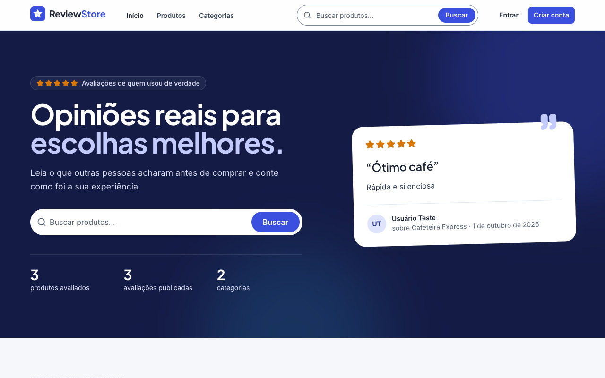
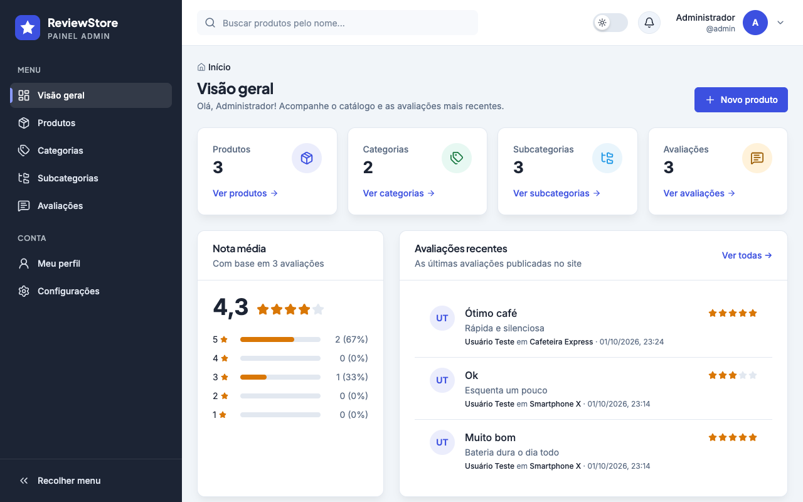
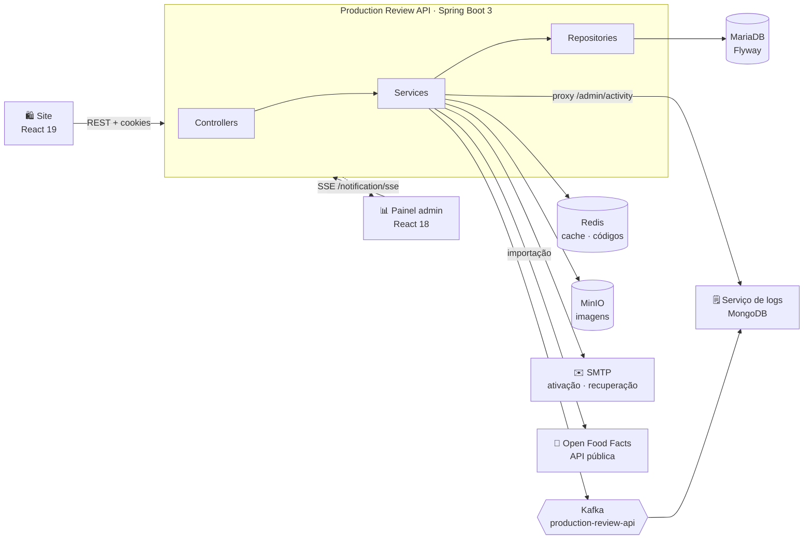
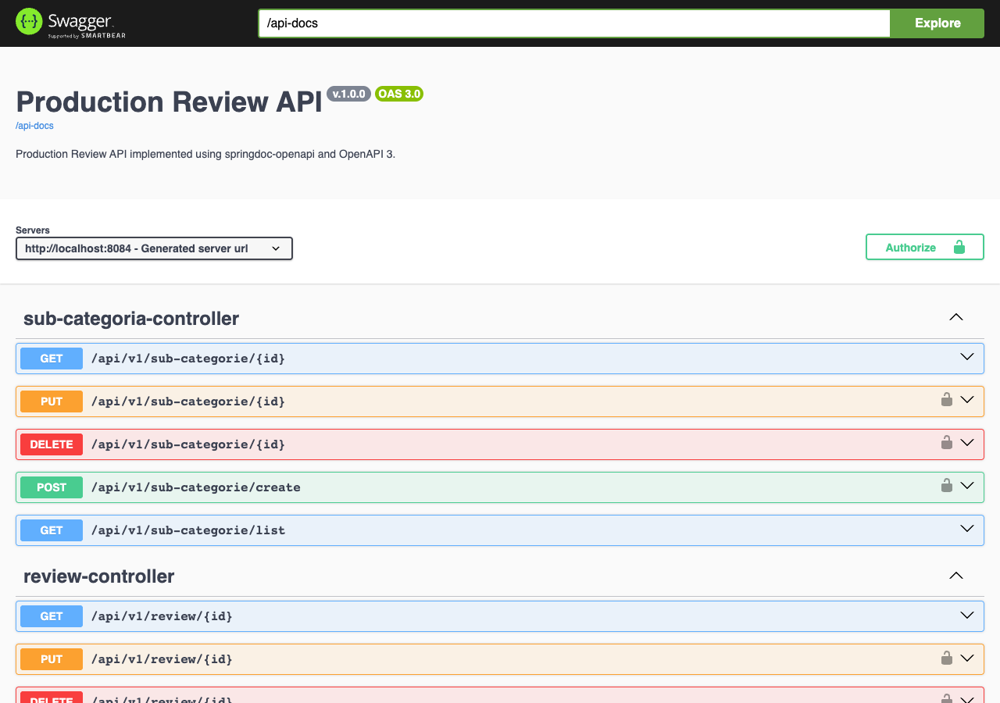
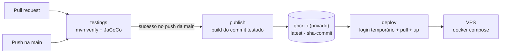

<div align="center">


# Production Review API

**API REST do ecossistema ReviewStore: autenticação, catálogo de produtos, avaliações, moderação e auditoria.**
Alimenta o [site público](https://github.com/erikomis/dashboard-production-review-site) e o [painel administrativo](https://github.com/erikomis/dashboard-production-review-react).

<p>
  
  
  
  
</p>
<p>
  
  
  
  
  
  
</p>

[Visão geral](#-visão-geral) ·
[Como rodar](#-como-rodar) ·
[Endpoints](#-endpoints) ·
[Segurança](#-segurança) ·
[Testes](#-testes) ·
[Deploy](#-cicd-e-deploy)

</div>

<br />

<table>
  <tr>
    <td width="50%"></td>
    <td width="50%"></td>
  </tr>
  <tr>
    <td align="center"><sub><b>Site</b>: avaliações públicas</sub></td>
    <td align="center"><sub><b>Painel</b>: gestão do catálogo</sub></td>
  </tr>
</table>

---

## 🔭 Visão geral



| Recurso | Destaques |
|---|---|
| 🔐 **Autenticação** | Cadastro com ativação por e-mail, login por usuário ou e-mail, JWT em cookies `httpOnly` (access + refresh), recuperação de senha com código de 6 dígitos |
| 🗂 **Catálogo** | Categorias → subcategorias → produtos, com slug, busca parcial, filtros por categoria/subcategoria, ordenação e paginação |
| 🏆 **Notas e ranking** | Listagem de produtos com nota média e total de avaliações; ranking por média (desempate pelo total) |
| ⭐ **Avaliações** | Nota de 1 a 5, filtros por nota, ordenação (recentes, antigas, maior/menor nota, mais úteis), distribuição de notas, "minhas avaliações" e regra de autoria (só o autor ou um ADMIN altera) |
| 👍 **Útil** | Qualquer usuário logado marca/desmarca a avaliação de outra pessoa como útil |
| 🛡 **Moderação** | ADMIN oculta avaliações com motivo obrigatório; ocultas somem das listas públicas e das médias |
| 👥 **Usuários** | ADMIN lista usuários, concede/remove o perfil ADMIN e ativa/desativa contas (token de conta desativada deixa de valer na hora) |
| 📊 **Estatísticas** | Totais, média, distribuição de notas, avaliações e cadastros por dia e top produtos/categorias |
| 🥫 **Importação** | Catálogo real do Open Food Facts (dados abertos, ODbL) em job assíncrono e idempotente |
| 🗒️ **Auditoria** | Cada ação relevante vira um evento de domínio no Kafka; o painel consulta o histórico pelo proxy `/admin/activity` |
| 🖼 **Imagens** | Upload para MinIO com validação de tipo e chave única por produto |
| 🔔 **Tempo real** | Cada avaliação nova também é emitida num stream **SSE** consumido pelo painel |
| ⚡ **Cache** | Redis com evicção consistente nas escritas |
| 📖 **Documentação** | OpenAPI 3 + Swagger UI em `/swagger-ui.html` |
| 📈 **Observabilidade** | Actuator + Prometheus em `/actuator/prometheus`, com Grafana no `docker-compose` |

## 🚀 Como rodar

### Pré-requisitos

- **Java 17** (o projeto inclui o Maven Wrapper: `./mvnw`)
- **Docker** para MariaDB, Redis e, opcionalmente, Mailpit, Kafka e MinIO

### 1. Suba as dependências

```bash
docker run -d --name prv-mariadb -p 3306:3306 \
  -e MARIADB_ROOT_PASSWORD=root -e MARIADB_DATABASE=production mariadb:11.3

docker run -d --name prv-redis -p 6379:6379 redis:6.2

# opcional: caixa de e-mail local para ver os e-mails de ativação (http://localhost:8026)
docker run -d --name prv-mailpit -p 1026:1025 -p 8026:8025 axllent/mailpit
```

### 2. Rode a API

```bash
export DATABASE_URL=jdbc:mariadb://localhost:3306/production
export DATABASE_USERNAME=root DATABASE_PASSWORD=root
export REDIS=localhost
export SECRET=troque-por-um-segredo-longo
export ACESS_NAME=minio ACESS_SECRET=minio-secret
export MAIL_USERNAME=dev@local MAIL_PASSWORD=x
export ALLOWED_ORIGINS=http://localhost:5173,http://localhost:5174
export FRONTEND_URL=http://localhost:5173

./mvnw spring-boot:run -Dspring-boot.run.arguments="\
  --spring.mail.host=localhost --spring.mail.port=1026 \
  --spring.mail.properties.mail.smtp.auth=false \
  --spring.mail.properties.mail.smtp.starttls.enable=false"
```

A API sobe em **http://localhost:8084**, e o Flyway cria as tabelas e os perfis `ADMIN`, `USER` e `MODERATOR`.

> [!TIP]
> Para ter um administrador, cadastre-se normalmente (`POST /api/v1/auth/sign-up`), ative pelo link do e-mail e associe o perfil:
> ```sql
> INSERT INTO users_roles (user_id, role_id)
> SELECT u.id, r.id FROM user u, role r WHERE u.username = 'seu-usuario' AND r.name = 'ADMIN';
> ```

### Variáveis de ambiente

<details open>
<summary><b>Obrigatórias</b></summary>

| Variável | Descrição |
|---|---|
| `DATABASE_URL` · `DATABASE_USERNAME` · `DATABASE_PASSWORD` | Conexão com o MariaDB |
| `REDIS` | Host do Redis (porta 6379) |
| `SECRET` | Segredo HMAC dos tokens JWT, **sem valor padrão** de propósito |
| `ACESS_NAME` · `ACESS_SECRET` | Credenciais do MinIO |
| `MAIL_USERNAME` · `MAIL_PASSWORD` | Conta SMTP (Gmail por padrão) |

</details>

<details>
<summary><b>Opcionais</b></summary>

| Variável | Padrão | Descrição |
|---|---|---|
| `ALLOWED_ORIGINS` | `http://localhost:5173,http://localhost:8084,https://projetos-web.com` | Origens aceitas no CORS e nos links de e-mail |
| `FRONTEND_URL` | `https://projetos-web.com` | Base dos links de e-mail quando o `Origin` não está na lista |
| `URL` | `https://storage.projetos-web.com` | Endpoint do MinIO |
| `BUCKET_NAME` | `production-review` | Bucket das imagens |
| `KAFKA_BOOTSTRAP_SERVERS` | `localhost:9092` | Brokers do Kafka (sem Kafka, a API segue funcionando e só registra um aviso) |
| `LOGS_SERVICE_URL` | `http://localhost:8089` | Serviço de logs (`production-review-api-logs`) usado pelo proxy `/admin/activity` |
| `LOGS_API_TOKEN` | vazio | Token enviado no header `X-Internal-Token` ao serviço de logs |
| `OPEN_FOOD_FACTS_URL` | `https://world.openfoodfacts.org` | Base da API do Open Food Facts |
| `OPEN_FOOD_FACTS_MIN_INTERVAL_MS` | `6500` | Intervalo mínimo entre buscas (limite deles: ~10 por minuto) |
| `OPEN_FOOD_FACTS_RETRY_DELAY_MS` | `15000` | Espera antes do único retry em 429/503/resposta não-JSON |
| `PROFILE` | `dev` | Perfil ativo do Spring |

</details>

## 📡 Endpoints

Base: `/api/v1`. A documentação interativa completa fica em **`/swagger-ui.html`**.

<p align="center">
  
</p>

<details>
<summary><b>🔐 Autenticação</b> · <code>/auth</code> (pública)</summary>

| Método | Rota | Descrição |
|---|---|---|
| `POST` | `/auth/sign-up` | Cadastro (envia e-mail de ativação) |
| `GET` | `/auth/activate/{token}` | Ativa a conta (token válido por 24h) |
| `POST` | `/auth/sign-in` | Login por usuário ou e-mail; devolve cookies `token` e `refresh_token` |
| `POST` | `/auth/refresh-token` | Renova a sessão usando o refresh token |
| `POST` | `/auth/logout` | Encerra a sessão |
| `POST` | `/auth/send-recovery-code/send` | Envia código de recuperação de 6 dígitos |
| `GET` | `/auth/recovery-code?recoveryCode=&email=` | Valida o código |
| `PATCH` | `/auth/recovery-code/password` | Redefine a senha (código de uso único) |

</details>

<details>
<summary><b>🗂 Catálogo</b> · GET público, escrita só para ADMIN</summary>

| Método | Rota | Descrição |
|---|---|---|
| `GET` | `/category/list` | Categorias com subcategorias aninhadas |
| `GET` | `/category/slug/{slug}` | Categoria por slug com `subCategories` (404 se não existir) |
| `GET` · `PUT` · `DELETE` | `/category/{id}` | Detalhe, edição e exclusão (409 se houver subcategorias) |
| `POST` | `/category/` | Cria categoria |
| `GET` | `/sub-categorie/list` | Subcategorias |
| `GET` · `PUT` · `DELETE` | `/sub-categorie/{id}` | Detalhe, edição e exclusão |
| `POST` | `/sub-categorie/create` | Cria subcategoria |
| `GET` | `/production/list?page&size&search&categoryId&subCategorieId&onlyRated&property&sort` | Página de `ProductSummary` (com `averageNote`, `totalReviews`, categoria e imagem). `property` ∈ `name`, `createdAt`, `averageNote`, `totalReviews` (outro valor → 400). Ranking: `property=averageNote&sort=DESC&onlyRated=true` |
| `GET` | `/production/{id}` · `/production/slug/{slug}` | `ProductDetail`: o resumo acima + todas as `images` |
| `POST` | `/production/add` | Cria produto |
| `PUT` | `/production/update/{id}` | Edita produto |
| `DELETE` | `/production/delete/{id}` | Exclui produto |
| `POST` · `DELETE` | `/production/file` · `/production/file/{id}` | Upload e remoção de imagem (JPEG, PNG, WebP, GIF) |

</details>

<details>
<summary><b>⭐ Avaliações</b> · GET público, escrita exige login</summary>

| Método | Rota | Descrição |
|---|---|---|
| `GET` | `/review/list?page&size` | Avaliações visíveis, mais recentes primeiro, com nome/slug do produto, autor e contagem de "útil" |
| `GET` | `/review/product/{id}?page&size&note&sort` | Avaliações visíveis de um produto; `note` de 1 a 5; `sort` ∈ `recent`, `oldest`, `highest`, `lowest`, `helpful`. `helpfulByMe` vem preenchido se houver login |
| `GET` | `/review/product/{id}/summary` | `{ productId, totalReviews, averageNote, distribution: {"1".."5"} }` (só visíveis) |
| `GET` | `/review/me?page&size` | **Login.** Minhas avaliações, inclusive as ocultadas (com status e motivo) |
| `POST` | `/review/{id}/helpful` | **Login.** Alterna "útil" → `{ reviewId, helpfulCount, helpfulByMe }`; 400 na própria avaliação, 404 se oculta |
| `GET` | `/review/{id}` | Detalhe (oculta só para o autor ou ADMIN) |
| `POST` | `/review/` | Publica avaliação (`note` de 1 a 5) |
| `PUT` · `DELETE` | `/review/{id}` | Só o autor ou um ADMIN; editar não muda o status de moderação |

</details>

<details>
<summary><b>👤 Usuário e notificações</b> · exige login</summary>

| Método | Rota | Descrição |
|---|---|---|
| `GET` | `/user/me` | Usuário logado com perfis e permissões |
| `GET` | `/notification/sse` | Stream SSE: um evento a cada avaliação criada |

</details>

<details>
<summary><b>🛠 Administração</b> · <code>/admin/**</code>, só ADMIN</summary>

| Método | Rota | Descrição |
|---|---|---|
| `GET` | `/admin/reviews?page&size&status&note&productId&search` | Todas as avaliações (`VISIBLE`/`HIDDEN`), com `moderatedByName` |
| `PATCH` | `/admin/reviews/{id}/moderation` | `{ status: "HIDDEN" \| "VISIBLE", reason }`; `reason` obrigatório ao ocultar |
| `GET` | `/admin/users?page&size&search&role&active` | Usuários com `roles`, `createdAt` e `reviewsCount`. `role=ADMIN` = tem o perfil ADMIN; `role=USER` = não tem |
| `PATCH` | `/admin/users/{id}/admin` | `{ admin: boolean }`; 400 ao remover o próprio ADMIN |
| `PATCH` | `/admin/users/{id}/active` | `{ active: boolean }`; 400 ao desativar a si mesmo |
| `GET` | `/admin/stats?days=30` | Totais, média, distribuição, séries diárias sem buracos (7 a 365 dias) e top 5 produtos/categorias |
| `POST` | `/admin/import/open-food-facts` | `{ productsPerSubcategory: 1..30 }` (padrão 12) → **202** com o job; **409** se já houver um rodando |
| `GET` | `/admin/import/jobs/{id}` · `/admin/import/jobs/latest` | Andamento do job (`latest` devolve 204 se nunca rodou) |
| `GET` | `/admin/activity?page&size&type&entityType&userId&search&from&to` | Histórico de auditoria (proxy do serviço de logs) |
| `GET` | `/admin/activity/summary?from&to` | Totais por tipo e por dia; **503** se o serviço de logs estiver fora |

</details>

### Importação do Open Food Facts

Usa a API pública de busca (`/api/v2/search`, produtos vendidos no Brasil, por popularidade), nunca HTML, com
`User-Agent: ProductionReview/1.0 (production-review-api)`, no mínimo 6,5 s entre buscas e um retry após 15 s em 429/503.
A taxonomia é fixa: **Bebidas** (Refrigerantes, Sucos e néctares, Cafés), **Laticínios** (Leites, Iogurtes, Queijos),
**Café da manhã** (Cereais matinais, Biscoitos, Pães) e **Doces e snacks** (Chocolates, Salgadinhos, Sorvetes).
Categorias, subcategorias e produtos já existentes (mesmo slug) são reaproveitados, então rodar de novo só completa o que faltou.
As imagens ficam no próprio Open Food Facts (`filename` `external:off:{code}`); removê-las não chama o MinIO.

### Eventos de auditoria

Publicados no tópico `production-review-api` depois que a operação dá certo (falha no Kafka vira só um aviso no log):

```json
{ "eventId": "uuid", "type": "REVIEW_CREATED", "action": "Avaliação criada",
  "message": "Usuário Teste avaliou Smartphone X com 5 estrelas", "nameUser": "Usuário Teste", "userId": 2,
  "entityType": "REVIEW", "entityId": "12", "occurredAt": "2026-10-02T03:10:00Z" }
```

Tipos: `USER_SIGNED_UP`, `USER_ACTIVATED`, `USER_LOGGED_IN`, `USER_ROLE_CHANGED`, `USER_STATUS_CHANGED`,
`CATEGORY_*`, `SUBCATEGORY_*`, `PRODUCT_*` (`CREATED`/`UPDATED`/`DELETED`), `PRODUCT_IMAGE_ADDED`/`REMOVED`,
`REVIEW_CREATED`/`UPDATED`/`DELETED`, `REVIEW_HIDDEN`/`RESTORED` e `CATALOG_IMPORT_STARTED`/`COMPLETED`/`FAILED`.

### Formatos de resposta

```jsonc
// Página
{ "content": [ /* ... */ ], "page": { "size": 10, "number": 0, "totalElements": 42, "totalPages": 5 } }

// Erro
{ "message": "title: Title is required", "httpStatus": "BAD_REQUEST", "statusCode": 400 }
```

| Status | Quando |
|---|---|
| `400` | Validação, parâmetro inválido ou JSON malformado |
| `401` | Não autenticado, sessão expirada ou credenciais inválidas |
| `403` | Sem permissão, ou conta ainda não ativada no login |
| `404` | Recurso não encontrado |
| `409` | Registro duplicado ou em uso |

## 🛡 Segurança

- **JWT em cookies `httpOnly` + `Secure`**, com access e refresh token de tipos distintos: um não serve no lugar do outro.
- **Senhas** com BCrypt. **Códigos de recuperação** de 6 dígitos gerados com `SecureRandom`, com expiração no Redis, uso único e invalidação após 5 tentativas.
- **Links de e-mail** só usam o `Origin` da requisição se ele estiver em `ALLOWED_ORIGINS`, o que evita phishing com o domínio da aplicação.
- **Autorização** por perfil e permissão (`@PreAuthorize`), mais a regra de autoria nas avaliações. Tudo em `/api/v1/admin/**` exige ADMIN já no `SecurityFilterChain`.
- **Contas desativadas** por um ADMIN perdem o acesso na hora: o filtro de autenticação e o refresh token deixam de aceitar o token delas.
- **Validação** de todos os payloads, com limites alinhados às colunas do banco, e erros sem expor SQL nem stack trace.
- **Nenhum segredo com valor padrão** no código: tudo vem do ambiente.

## 🧪 Testes

```bash
./mvnw verify   # testes + relatório de cobertura JaCoCo em target/site/jacoco
```

**268 testes** com cerca de **92% de cobertura de linhas**, distribuídos em:

| Camada | O que cobre |
|---|---|
| **Serviços** (Mockito) | Regras de negócio de auth, catálogo, avaliações, "útil", moderação, usuários, estatísticas e publicação de eventos |
| **Importação** (`@DataJpaTest` + cliente mockado) | Idempotência, produtos sem nome/imagem, descrição composta, erro por etapa e job único (409) |
| **Clientes HTTP** (`MockRestServiceServer`) | Open Food Facts (parâmetros, User-Agent, throttle, retry) e proxy do serviço de logs (repasse, 400, 503) |
| **Controllers** (`@WebMvcTest`) | Contratos HTTP, validação e códigos de erro, inclusive das rotas de admin |
| **Repositórios** (`@DataJpaTest` + H2) | Notas e ranking de produtos, filtros, `onlyRated`, só reviews visíveis, distribuição, busca de usuários |
| **Segurança** (`@SpringBootTest`) | Rotas públicas e protegidas, `/admin/**` (401/403/200), `/review/me`, usuário desativado, CORS, refresh token |
| **Unitários** | JWT (tipos, expiração, assinatura) e paginação |

Nenhum teste chama o Open Food Facts de verdade, e o throttle é configurável para os testes não dormirem.

## 🔁 CI/CD e deploy

As imagens são publicadas **privadas** no GitHub Container Registry (`ghcr.io`), e não mais no Docker Hub.



- **`testings.yml`**: roda em PRs e no push da `main`; publica os relatórios de cobertura e de testes.
- **`deployament.yml`**: só dispara depois que os testes do push na `main` passam.
  - **publish**: builda exatamente o commit testado e publica `ghcr.io/erikomis/production-review-api` com as tags `latest` e `sha-<commit>`, autenticando com o `GITHUB_TOKEN` do próprio workflow.
  - **deploy**: entra na VPS por SSH, faz login no GHCR com o token temporário do job, sobe a imagem daquele commit (`IMAGE_TAG=sha-<commit>`) e faz logout. O token expira ao fim do job, então **nenhuma credencial fica salva na VPS**.
- **Imagem Docker**: build multi-stage com cache de dependências; o runtime usa JRE 17 com usuário sem privilégios.
- **`docker-compose.yml`**: API (imagem do GHCR), Prometheus e Grafana. O `docker-compose.dev.yml` inclui também MariaDB e Redis.

### Configuração no GitHub

| Tipo | Nome | Para quê |
|---|---|---|
| Secret | `HOST`, `USERNAME`, `SSH_KEY` | Acesso SSH à VPS |
| Variável (opcional) | `DEPLOY_DIR` | Pasta do `docker-compose.yml` na VPS (padrão: `api`) |

Os secrets `DOCKER_USERNAME` e `DOCKER_PASSWORD` não são mais usados e podem ser apagados.

> [!IMPORTANT]
> **Uma única vez, antes do primeiro deploy:**
> 1. Copie o `docker-compose.yml` deste repositório para a pasta da VPS. O arquivo antigo aponta para a imagem pública do Docker Hub e continuaria subindo a versão velha.
> 2. Depois do primeiro publish, confira em **Perfil → Packages → production-review-api → Package settings** que a visibilidade está **Private**, e que em *Manage Actions access* este repositório tem acesso de leitura.

<details>
<summary><b>📁 Estrutura do projeto</b></summary>

```text
src/main/java/com/client/productionreview/
├── config/          # cache, CORS, Swagger, MinIO, verificação de permissões
├── controller/      # endpoints REST + mappers DTO ↔ entidade
├── dtos/            # contratos de entrada e saída (com Bean Validation)
├── exception/       # exceções de domínio e handler global
├── integration/     # e-mail, Open Food Facts e proxy do serviço de logs
├── message/         # produtor Kafka (eventos de domínio)
├── model/           # entidades JPA e hashes do Redis
├── provider/        # emissão e validação de JWT
├── repositories/    # Spring Data JPA e Redis
├── security/        # filtro de autenticação e SecurityFilterChain
├── service/         # regras de negócio
└── utils/           # paginação, notas e slugs
src/main/resources/db/migration/   # migrações Flyway
```

</details>

## 🧩 Ecossistema Production Review

| Projeto | Descrição |
|---|---|
| [**production-review-api**](https://github.com/erikomis/production-review-api) | Este repositório: API REST |
| [**dashboard-production-review-site**](https://github.com/erikomis/dashboard-production-review-site) | Site público onde as pessoas avaliam produtos |
| [**dashboard-production-review-react**](https://github.com/erikomis/dashboard-production-review-react) | Painel administrativo do catálogo e das avaliações |

<div align="center">
<br />
<sub>Feito com ☕ e Spring Boot.</sub>
</div>
