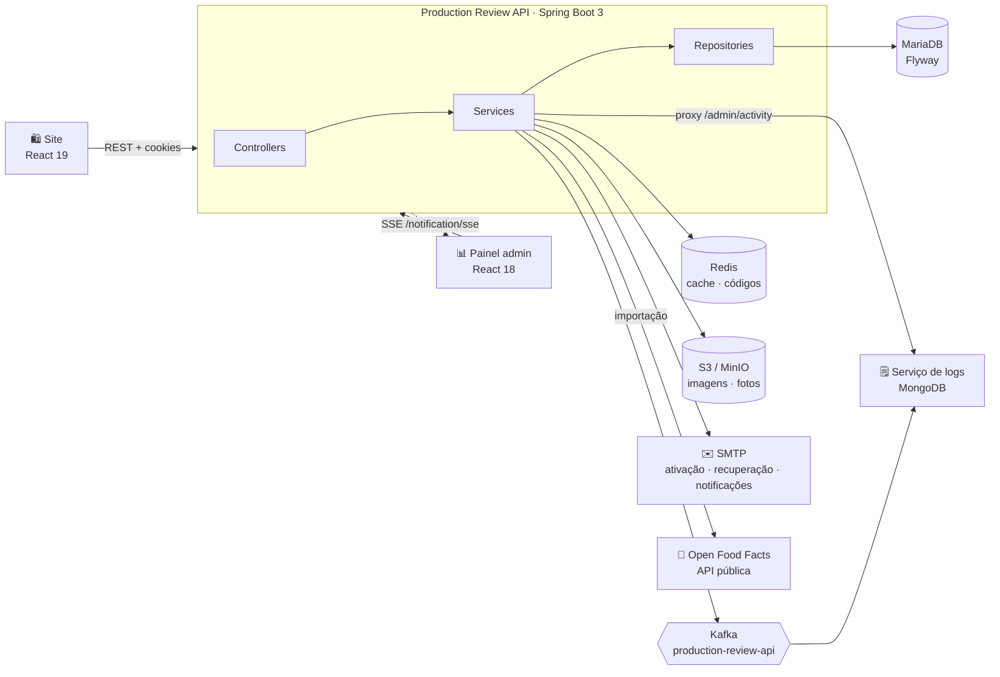
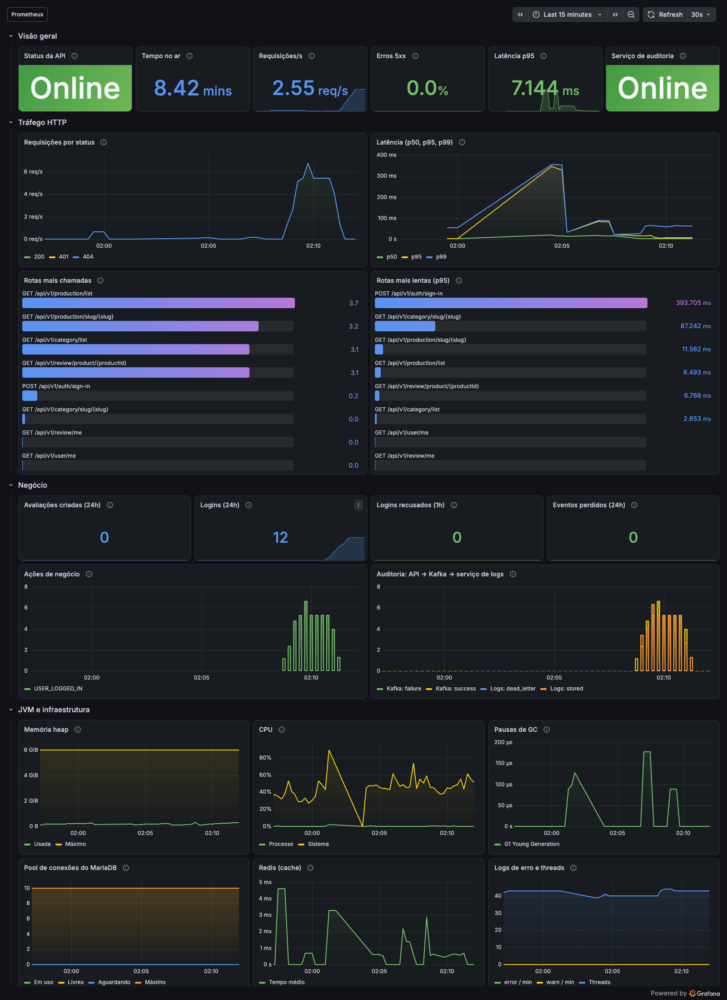
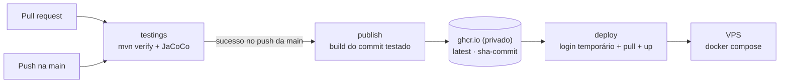

<div align="center">


# Production Review API

**API REST do ecossistema ReviewStore: autenticação, catálogo de produtos, avaliações com fotos, moderação, notificações e auditoria.**
Alimenta o [site público](https://github.com/erikomis/dashboard-production-review-site) e o [painel administrativo](https://github.com/erikomis/dashboard-production-review-react).

<p>
  
  
  
  
</p>
<p>
  
  
  
  
  
  
</p>

[Visão geral](#-visão-geral) ·
[Como rodar](#-como-rodar) ·
[Endpoints](#-endpoints) ·
[Segurança](#-segurança) ·
[Testes](#-testes) ·
[Observabilidade](#-observabilidade) ·
[Deploy](#-cicd-e-deploy)

</div>

<br />

<table>
  <tr>
    <td width="50%"></td>
    <td width="50%"></td>
  </tr>
  <tr>
    <td align="center"><sub><b>Site</b>: avaliações públicas</sub></td>
    <td align="center"><sub><b>Painel</b>: gestão do catálogo</sub></td>
  </tr>
</table>

---

## 🔭 Visão geral



| Recurso | Destaques |
|---|---|
| 🔐 **Autenticação** | Cadastro com ativação por e-mail, login por usuário ou e-mail, JWT em cookies `httpOnly` (access + refresh), recuperação de senha com código de 6 dígitos |
| 🗂 **Catálogo** | Categorias → subcategorias → produtos, com slug, busca sem acento ("cafe" acha "Café"), autocompletar, filtros por categoria/subcategoria, ordenação e paginação |
| 🏆 **Notas e ranking** | Listagem de produtos com nota média e total de avaliações; ranking por média (desempate pelo total) |
| ⭐ **Avaliações** | Nota de 1 a 5, até 3 fotos por avaliação, filtros por nota, ordenação (recentes, antigas, maior/menor nota, mais úteis), distribuição de notas, "minhas avaliações" e regra de autoria (só o autor ou um ADMIN altera) |
| 👍 **Útil e denúncias** | Qualquer usuário logado marca a avaliação de outra pessoa como útil ou a denuncia (spam, ofensiva, informação falsa, outro) |
| 🛡 **Moderação** | ADMIN oculta avaliações com motivo obrigatório (individualmente ou em lote), vê e descarta denúncias e publica a resposta oficial da equipe |
| 🔔 **Notificações** | Sino no site (ocultação, restauração, "útil", resposta oficial, nova avaliação em produto seguido) e e-mail assíncrono, respeitando a preferência do usuário |
| ❤️ **Seguir produtos** | O usuário segue produtos e é avisado de novas avaliações; perfil público com estatísticas |
| 🔎 **SEO** | `sitemap.xml` com as páginas do site e dados prontos para o JSON-LD (Product, AggregateRating, Review) |
| 👥 **Usuários** | ADMIN lista usuários, concede/remove o perfil ADMIN e ativa/desativa contas (token de conta desativada deixa de valer na hora) |
| 📊 **Estatísticas** | Totais, média, distribuição de notas, avaliações e cadastros por dia e top produtos/categorias |
| 🥫 **Importação** | Catálogo real do Open Food Facts (dados abertos, ODbL) em job assíncrono e idempotente, sem duplicar nomes na mesma subcategoria; remoção de duplicados sob demanda |
| 📤 **Exportação** | CSV (UTF-8 com BOM, `;`) de avaliações, usuários e atividade para abrir direto no Excel |
| 🗒️ **Auditoria** | Cada ação relevante vira um evento de domínio no Kafka; o painel consulta o histórico pelo proxy `/admin/activity` |
| 🖼 **Imagens** | Upload para S3/MinIO com validação de tipo (inclusive pelos bytes do arquivo) e chave única; as fotos das avaliações são servidas por proxy em `/files` |
| 📡 **Tempo real** | Cada avaliação nova também é emitida num stream **SSE** consumido pelo painel |
| ⚡ **Cache** | Redis com evicção consistente nas escritas |
| 📖 **Documentação** | OpenAPI 3 + Swagger UI em `/swagger-ui.html` |
| 📈 **Observabilidade** | Prometheus + Grafana provisionados: dashboard pronto, métricas de negócio, latência p95/p99 e alertas por e-mail ([detalhes](#-observabilidade)) |

## 🚀 Como rodar

### Pré-requisitos

- **Java 17** (o projeto inclui o Maven Wrapper: `./mvnw`)
- **Docker** para MariaDB, Redis e, opcionalmente, Mailpit, Kafka e um S3 local (MinIO ou SeaweedFS)

### 1. Suba as dependências

```bash
docker run -d --name prv-mariadb -p 3306:3306 \
  -e MARIADB_ROOT_PASSWORD=root -e MARIADB_DATABASE=production mariadb:11.3

docker run -d --name prv-redis -p 6379:6379 redis:6.2

# opcional: caixa de e-mail local para ver os e-mails de ativação e de notificações (http://localhost:8026)
docker run -d --name prv-mailpit -p 1026:1025 -p 8026:8025 axllent/mailpit

# opcional: S3 local sem autenticação para as fotos das avaliações (http://localhost:9000)
docker run -d --name prv-s3 -p 9000:8333 chrislusf/seaweedfs server -s3
```

### 2. Rode a API

```bash
export DATABASE_URL=jdbc:mariadb://localhost:3306/production
export DATABASE_USERNAME=root DATABASE_PASSWORD=root
export REDIS=localhost
export SECRET=troque-por-um-segredo-longo
export ACESS_NAME=minio ACESS_SECRET=minio-secret
export MAIL_USERNAME=dev@local MAIL_PASSWORD=x
export ALLOWED_ORIGINS=http://localhost:5173,http://localhost:5174
export FRONTEND_URL=http://localhost:5173
export SITE_URL=http://localhost:5174
export URL=http://localhost:9000 BUCKET_NAME=production-review

./mvnw spring-boot:run -Dspring-boot.run.arguments="\
  --spring.mail.host=localhost --spring.mail.port=1026 \
  --spring.mail.properties.mail.smtp.auth=false \
  --spring.mail.properties.mail.smtp.starttls.enable=false"
```

A API sobe em **http://localhost:8084**, e o Flyway cria as tabelas e os perfis `ADMIN`, `USER` e `MODERATOR`.
A JVM e o Hibernate trabalham em **UTC**; na primeira subida depois da migração V4, o `SearchNameBackfill` preenche o nome
normalizado (`search_name`) dos produtos antigos.

### Variáveis de ambiente

<details open>
<summary><b>Obrigatórias</b></summary>

| Variável | Descrição |
|---|---|
| `DATABASE_URL` · `DATABASE_USERNAME` · `DATABASE_PASSWORD` | Conexão com o MariaDB |
| `REDIS` | Host do Redis (porta 6379) |
| `SECRET` | Segredo HMAC dos tokens JWT, **sem valor padrão** de propósito |
| `ACESS_NAME` · `ACESS_SECRET` | Credenciais do S3/MinIO (vazias = requisições anônimas, como no SeaweedFS local) |
| `MAIL_USERNAME` · `MAIL_PASSWORD` | Conta SMTP (Gmail por padrão) |

</details>

<details>
<summary><b>Opcionais</b></summary>

| Variável | Padrão | Descrição |
|---|---|---|
| `ALLOWED_ORIGINS` | `http://localhost:5173,http://localhost:8084,https://projetos-web.com` | Origens aceitas no CORS e nos links de e-mail |
| `FRONTEND_URL` | `https://projetos-web.com` | Base dos links de e-mail quando o `Origin` não está na lista |
| `SITE_URL` | `http://localhost:5174` | Endereço do site público: links dos e-mails de notificação, `sitemap.xml` e JSON-LD |
| `URL` | `https://storage.projetos-web.com` | Endpoint do S3/MinIO; esquema e porta são respeitados (local: `http://localhost:9000`) |
| `BUCKET_NAME` | `production-review` | Bucket (privado) das imagens e das fotos das avaliações |
| `COOKIE_SAME_SITE` | `Lax` | Atributo `SameSite` dos cookies de sessão |
| `COOKIE_SECURE` | `true` | Atributo `Secure` dos cookies de sessão |
| `RATE_LIMIT_ENABLED` | `true` | Liga o limite de tentativas (os limites de cada regra ficam em `app.rate-limit.rules.*`) |
| `KAFKA_BOOTSTRAP_SERVERS` | `localhost:9092` | Brokers do Kafka (sem Kafka, a API segue funcionando e só registra um aviso) |
| `LOGS_SERVICE_URL` | `http://localhost:8089` | Serviço de logs (`production-review-api-logs`) usado pelo proxy `/admin/activity` |
| `LOGS_API_TOKEN` | vazio | Token enviado no header `X-Internal-Token` ao serviço de logs |
| `OPEN_FOOD_FACTS_URL` | `https://world.openfoodfacts.org` | Base da API do Open Food Facts |
| `OPEN_FOOD_FACTS_MIN_INTERVAL_MS` | `6500` | Intervalo mínimo entre buscas (limite deles: ~10 por minuto) |
| `OPEN_FOOD_FACTS_RETRY_DELAY_MS` | `15000` | Espera antes do único retry em 429/503/resposta não-JSON |
| `PROFILE` | `dev` | Perfil ativo do Spring |

</details>

## 📡 Endpoints

Base: `/api/v1`. A documentação interativa completa fica em **`/swagger-ui.html`**.

<p align="center">
  
</p>

<details>
<summary><b>🔐 Autenticação</b> · <code>/auth</code> (pública)</summary>

| Método | Rota | Descrição |
|---|---|---|
| `POST` | `/auth/sign-up` | Cadastro (envia e-mail de ativação). Senha de 8 a 72 caracteres, com letras e números |
| `GET` | `/auth/activate/{token}` | Ativa a conta (token válido por 24h) |
| `POST` | `/auth/sign-in` | Login por usuário ou e-mail; devolve cookies `token` e `refresh_token` |
| `POST` | `/auth/refresh-token` | Renova a sessão usando o refresh token |
| `POST` | `/auth/logout` | Encerra a sessão |
| `POST` | `/auth/send-recovery-code/send` | Envia código de recuperação de 6 dígitos |
| `GET` | `/auth/recovery-code?recoveryCode=&email=` | Valida o código |
| `PATCH` | `/auth/recovery-code/password` | Redefine a senha (código de uso único; mesma política de senha do cadastro) |

</details>

<details>
<summary><b>🗂 Catálogo</b> · GET público, escrita só para ADMIN</summary>

| Método | Rota | Descrição |
|---|---|---|
| `GET` | `/category/list` | Categorias com subcategorias aninhadas |
| `GET` | `/category/slug/{slug}` | Categoria por slug com `subCategories` (404 se não existir) |
| `GET` · `PUT` · `DELETE` | `/category/{id}` | Detalhe, edição e exclusão (409 se houver subcategorias) |
| `POST` | `/category/` | Cria categoria |
| `GET` | `/sub-categorie/list` | Subcategorias |
| `GET` · `PUT` · `DELETE` | `/sub-categorie/{id}` | Detalhe, edição e exclusão |
| `POST` | `/sub-categorie/create` | Cria subcategoria |
| `GET` | `/production/list?page&size&search&categoryId&subCategorieId&onlyRated&property&sort` | Página de `ProductSummary` (com `averageNote`, `totalReviews`, categoria e imagem). `property` ∈ `name`, `createdAt`, `averageNote`, `totalReviews` (outro valor → 400). Ranking: `property=averageNote&sort=DESC&onlyRated=true` |
| `GET` | `/production/{id}` · `/production/slug/{slug}` | `ProductDetail`: o resumo acima + todas as `images`, `followersCount` e `followedByMe` |
| `GET` | `/production/suggest?q&limit=8` | Autocompletar: `[{id, name, slug, imageUrl, categoryName}]`, sem acento/maiúsculas, nomes que começam com o termo primeiro. `q` com 2+ caracteres e `limit` de 1 a 10 (fora disso, 400) |
| `POST` · `DELETE` | `/production/{id}/follow` | **Login.** Segue/deixa de seguir → `{ following, followersCount }` (idempotente) |
| `POST` | `/production/add` | Cria produto |
| `PUT` | `/production/update/{id}` | Edita produto |
| `DELETE` | `/production/delete/{id}` | Exclui produto |
| `POST` · `DELETE` | `/production/file` · `/production/file/{id}` | Upload e remoção de imagem (JPEG, PNG, WebP, GIF) |

</details>

<details>
<summary><b>⭐ Avaliações</b> · GET público, escrita exige login</summary>

| Método | Rota | Descrição |
|---|---|---|
| `GET` | `/review/list?page&size` | Avaliações visíveis, mais recentes primeiro, com nome/slug do produto, autor e contagem de "útil" |
| `GET` | `/review/product/{id}?page&size&note&sort` | Avaliações visíveis de um produto; `note` de 1 a 5; `sort` ∈ `recent`, `oldest`, `highest`, `lowest`, `helpful`. `helpfulByMe` vem preenchido se houver login |
| `GET` | `/review/product/{id}/summary` | `{ productId, totalReviews, averageNote, distribution: {"1".."5"} }` (só visíveis) |
| `GET` | `/review/me?page&size` | **Login.** Minhas avaliações, inclusive as ocultadas (com status e motivo) |
| `POST` | `/review/{id}/helpful` | **Login.** Alterna "útil" → `{ reviewId, helpfulCount, helpfulByMe }`; 400 na própria avaliação, 404 se oculta |
| `GET` | `/review/{id}` | Detalhe (oculta só para o autor ou ADMIN) |
| `POST` | `/review/` | Publica avaliação (`note` de 1 a 5) |
| `PUT` · `DELETE` | `/review/{id}` | Só o autor ou um ADMIN; editar não muda o status de moderação |
| `POST` | `/review/{id}/images` | **Autor.** Multipart `file` (JPEG, PNG ou WebP, até 5 MB, no máximo 3 por avaliação) → **201** `{ id, url }` |
| `DELETE` | `/review/{id}/images/{imageId}` | Autor ou ADMIN → 204 |
| `POST` | `/review/{id}/report` | **Login.** `{ reason: SPAM \| OFFENSIVE \| FALSE_INFORMATION \| OTHER, details? (até 500) }` → 201; 409 se já denunciou, 400 na própria avaliação, 404 se oculta |

Cada avaliação traz também `userUsername`, `images: [{id, url}]`, `reportedByMe` e `reply: {text, authorName, repliedAt} | null`.
As datas de todas as respostas saem em ISO-8601 UTC com `Z` (ex.: `"2026-10-02T02:14:49Z"`).

</details>

<details>
<summary><b>👤 Usuário e notificações</b> · exige login</summary>

| Método | Rota | Descrição |
|---|---|---|
| `GET` | `/user/me` | Usuário logado com perfis e permissões |
| `GET` · `PATCH` | `/user/me/preferences` | `{ emailNotifications: boolean }` |
| `GET` | `/user/me/following?page&size` | Página de `ProductSummary` dos produtos seguidos |
| `GET` | `/notifications?page&size&unreadOnly` | `{id, type, title, message, link, read, createdAt}`, mais recentes primeiro. `link` é um caminho do site |
| `GET` | `/notifications/unread-count` | `{ count }` |
| `PATCH` | `/notifications/{id}/read` · `/notifications/read-all` | Marca como lida(s) → 204 |
| `GET` | `/notification/sse` | Stream SSE: um evento a cada avaliação criada |

Tipos: `REVIEW_HIDDEN`, `REVIEW_RESTORED`, `REVIEW_HELPFUL` (no máximo uma não lida por avaliação, com a contagem atualizada),
`REVIEW_REPLIED` e `FOLLOWED_PRODUCT_REVIEW`. Ocultação, resposta oficial e produto seguido também geram e-mail
(assíncrono, sem atrasar nem quebrar a operação), com links para `SITE_URL`.

</details>

<details>
<summary><b>🌐 Perfil público, arquivos e SEO</b> · públicos</summary>

| Método | Rota | Descrição |
|---|---|---|
| `GET` | `/users/{username}` | `{ username, name, memberSince, reviewsCount, helpfulReceived, averageNoteGiven }` (sem e-mail; 404 se não existir ou estiver inativo) |
| `GET` | `/users/{username}/reviews?page&size` | Avaliações visíveis do usuário |
| `GET` | `/files/{key...}` | Proxy em streaming do bucket privado, com `Content-Type` e `Cache-Control: public, max-age=86400`; só chaves geradas pela API (`reviews/{id}/{uuid}.ext`), 400 para chaves inválidas, 404 se não existir |
| `GET` | `/seo/sitemap.xml` | Sitemap do site (`/`, `/products`, `/ranking`, categorias e produtos com `lastmod`), cache de 1 h |
| `GET` | `/seo/products/{slug}` | Dados para o JSON-LD: `name`, `description`, `image`, `brand?`, `url`, `aggregateRating`, até 5 avaliações mais úteis |

</details>

<details>
<summary><b>🛠 Administração</b> · <code>/admin/**</code>, só ADMIN</summary>

| Método | Rota | Descrição |
|---|---|---|
| `GET` | `/admin/reviews?page&size&status&note&productId&search&reported` | Todas as avaliações (`VISIBLE`/`HIDDEN`), com `moderatedByName` e `reportsCount`; `reported=true` mostra só as denunciadas |
| `PATCH` | `/admin/reviews/{id}/moderation` | `{ status: "HIDDEN" \| "VISIBLE", reason }`; `reason` obrigatório ao ocultar. Ocultar resolve as denúncias |
| `PATCH` | `/admin/reviews/moderation` | Lote: `{ ids: [1..100], status, reason? }` → `{ updated }` (mesmas regras do individual) |
| `GET` · `DELETE` | `/admin/reviews/{id}/reports` | Denúncias `{id, reason, details, reporterName, createdAt}` · descarta todas (204) |
| `PUT` · `DELETE` | `/admin/reviews/{id}/reply` | Resposta oficial `{ text: 1..1000 }` → avaliação · remove (204) |
| `GET` | `/admin/reviews/export.csv` · `/admin/users/export.csv` · `/admin/activity/export.csv` | CSV com os mesmos filtros das listagens (até 10.000 linhas), UTF-8 com BOM e `;` |
| `POST` | `/admin/catalog/deduplicate` | Agrupa produtos com o mesmo nome normalizado na mesma subcategoria, mantém o mais antigo e remove os demais **sem avaliações** → `{ groups, removed, keptIds, removedIds }` |
| `GET` | `/admin/users?page&size&search&role&active` | Usuários com `roles`, `createdAt` e `reviewsCount`. `role=ADMIN` = tem o perfil ADMIN; `role=USER` = não tem |
| `PATCH` | `/admin/users/{id}/admin` | `{ admin: boolean }`; 400 ao remover o próprio ADMIN |
| `PATCH` | `/admin/users/{id}/active` | `{ active: boolean }`; 400 ao desativar a si mesmo |
| `GET` | `/admin/stats?days=30` | Totais, média, distribuição, séries diárias sem buracos (7 a 365 dias) e top 5 produtos/categorias |
| `POST` | `/admin/import/open-food-facts` | `{ productsPerSubcategory: 1..30 }` (padrão 12) → **202** com o job; **409** se já houver um rodando |
| `GET` | `/admin/import/jobs/{id}` · `/admin/import/jobs/latest` | Andamento do job (`latest` devolve 204 se nunca rodou) |
| `GET` | `/admin/activity?page&size&type&entityType&userId&search&from&to` | Histórico de auditoria (proxy do serviço de logs) |
| `GET` | `/admin/activity/summary?from&to` | Totais por tipo e por dia; **503** se o serviço de logs estiver fora |

</details>

### Importação do Open Food Facts

Usa a API pública de busca (`/api/v2/search`, produtos vendidos no Brasil, por popularidade), nunca HTML, com
`User-Agent: ProductionReview/1.0 (production-review-api)`, no mínimo 6,5 s entre buscas e um retry após 15 s em 429/503.
A taxonomia é fixa: **Bebidas** (Refrigerantes, Sucos e néctares, Cafés), **Laticínios** (Leites, Iogurtes, Queijos),
**Café da manhã** (Cereais matinais, Biscoitos, Pães) e **Doces e snacks** (Chocolates, Salgadinhos, Sorvetes).
Categorias, subcategorias e produtos já existentes (mesmo slug) são reaproveitados, então rodar de novo só completa o que faltou.
Um produto com o mesmo nome normalizado (minúsculas, sem acento, espaços colapsados) de outro da mesma subcategoria não é criado.
As imagens ficam no próprio Open Food Facts (`filename` `external:off:{code}`); removê-las não chama o MinIO.

### Eventos de auditoria

Publicados no tópico `production-review-api` depois que a operação dá certo (falha no Kafka vira só um aviso no log):

```json
{ "eventId": "uuid", "type": "REVIEW_CREATED", "action": "Avaliação criada",
  "message": "Usuário Teste avaliou Smartphone X com 5 estrelas", "nameUser": "Usuário Teste", "userId": 2,
  "entityType": "REVIEW", "entityId": "12", "occurredAt": "2026-10-02T03:10:00Z" }
```

Tipos: `USER_SIGNED_UP`, `USER_ACTIVATED`, `USER_LOGGED_IN`, `USER_ROLE_CHANGED`, `USER_STATUS_CHANGED`,
`CATEGORY_*`, `SUBCATEGORY_*`, `PRODUCT_*` (`CREATED`/`UPDATED`/`DELETED`), `PRODUCT_IMAGE_ADDED`/`REMOVED`,
`REVIEW_CREATED`/`UPDATED`/`DELETED`, `REVIEW_HIDDEN`/`RESTORED`, `REVIEW_REPORTED`, `REVIEW_REPORTS_DISMISSED`,
`REVIEW_REPLIED`, `REVIEW_REPLY_DELETED`, `REVIEW_IMAGE_ADDED`/`REMOVED`, `REVIEWS_BULK_MODERATED`,
`PRODUCT_FOLLOWED`/`UNFOLLOWED`, `CATALOG_DEDUPLICATED` e `CATALOG_IMPORT_STARTED`/`COMPLETED`/`FAILED`.

### Formatos de resposta

```jsonc
// Página
{ "content": [ /* ... */ ], "page": { "size": 10, "number": 0, "totalElements": 42, "totalPages": 5 } }

// Erro
{ "message": "title: Title is required", "httpStatus": "BAD_REQUEST", "statusCode": 400 }
```

| Status | Quando |
|---|---|
| `400` | Validação, parâmetro inválido ou JSON malformado |
| `401` | Não autenticado, sessão expirada ou credenciais inválidas |
| `403` | Sem permissão, conta ainda não ativada no login, ou `Origin` não permitido |
| `404` | Recurso não encontrado |
| `409` | Registro duplicado ou em uso (ex.: denúncia repetida) |
| `429` | Muitas tentativas; o header `Retry-After` diz quantos segundos esperar |

## 🛡 Segurança

- **JWT em cookies `httpOnly` + `Secure` + `SameSite=Lax`** (configuráveis), com access e refresh token de tipos distintos: um não serve no lugar do outro.
- **Verificação de Origin (CSRF)**: `POST`/`PUT`/`PATCH`/`DELETE` em `/api/v1/**` com `Origin` (ou, na falta dele, `Referer`) fora de `ALLOWED_ORIGINS` recebem **403** `Origem não permitida`. Sem os dois headers (curl, apps nativos) a requisição passa.
- **Limite de tentativas** (Redis, janela fixa, `INCR` + `EXPIRE`), com **429** + `Retry-After` e a métrica `reviewstore_rate_limit_rejections_total{rule}`:

  | Rota | Limite |
  |---|---|
  | `POST /auth/sign-in` | 5/min por IP+login e 20/min por IP |
  | `POST /auth/sign-up` | 5/hora por IP |
  | `POST /auth/send-recovery-code/send` | 3/15 min por e-mail e 10/hora por IP |
  | `GET /auth/recovery-code` · `PATCH /auth/recovery-code/password` | 10/15 min por IP |
  | `POST /review/` | 10/hora por usuário |
  | `POST /review/{id}/report` | 20/hora por usuário |

  O IP é o `remoteAddr` (atrás de proxy, `server.forward-headers-strategy=native` usa o `X-Forwarded-For`). Se o Redis cair, ninguém é bloqueado.
- **Senhas** com BCrypt e política de 8 a 72 caracteres com letras e números no cadastro e na redefinição (o login não valida formato, então contas antigas continuam entrando). **Códigos de recuperação** de 6 dígitos gerados com `SecureRandom`, com expiração no Redis, uso único e invalidação após 5 tentativas.
- **Links de e-mail** só usam o `Origin` da requisição se ele estiver em `ALLOWED_ORIGINS`, o que evita phishing com o domínio da aplicação.
- **Autorização** por perfil e permissão (`@PreAuthorize`), mais a regra de autoria nas avaliações. Tudo em `/api/v1/admin/**` exige ADMIN já no `SecurityFilterChain`.
- **Contas desativadas** por um ADMIN perdem o acesso na hora: o filtro de autenticação e o refresh token deixam de aceitar o token delas.
- **Uploads**: tipo conferido pelo `Content-Type` **e** pelos primeiros bytes do arquivo; o `/files` só serve chaves geradas pela própria API (sem `..` nem caminhos fora dos prefixos), com o `Content-Type` definido pela extensão.
- **CSV** com proteção contra injeção de fórmulas (células que começam com `=`, `+`, `-` ou `@` recebem um apóstrofo).
- **Validação** de todos os payloads, com limites alinhados às colunas do banco, e erros sempre no formato da API (inclusive 429, 403 de Origin e URLs recusadas pelo firewall), sem expor SQL nem stack trace.
- **Nenhum segredo com valor padrão** no código: tudo vem do ambiente.

## 🧪 Testes

```bash
./mvnw verify   # testes + relatório de cobertura JaCoCo em target/site/jacoco
```

**483 testes** com cerca de **93% de cobertura de linhas**, distribuídos em:

| Camada | O que cobre |
|---|---|
| **Serviços** (Mockito) | Regras de negócio de auth, catálogo, avaliações, fotos, denúncias, resposta oficial, moderação em lote, notificações (agregação, e-mail e preferência), seguidores, perfil, SEO, CSV, usuários, estatísticas e publicação de eventos |
| **Importação** (`@DataJpaTest` + cliente mockado) | Idempotência, produtos sem nome/imagem, descrição composta, erro por etapa e job único (409) |
| **Clientes HTTP** (`MockRestServiceServer`) | Open Food Facts (parâmetros, User-Agent, throttle, retry) e proxy do serviço de logs (repasse, 400, 503) |
| **Controllers** (`@WebMvcTest`) | Contratos HTTP, validação e códigos de erro, inclusive das rotas de admin |
| **Repositórios** (`@DataJpaTest` + H2) | Notas e ranking de produtos, filtros, busca sem acento, autocompletar, duplicados, `search_name`, denúncias, notificações, seguidores, perfil público, só reviews visíveis, busca de usuários |
| **Migrações** | A V4 roda no H2 em modo MySQL e cria as colunas usadas pelas entidades |
| **Segurança** (`@SpringBootTest`) | Rotas públicas e protegidas, `/admin/**` (401/403/200), usuário desativado, CORS, refresh token, Origin (403/permitido/GET sem Origin), cookies `SameSite`, 429 com `Retry-After` |
| **Unitários** | JWT (tipos, expiração, assinatura, `SameSite`), rate limit (regras, janela, Redis), filtro de Origin, CSV, normalização de texto, cliente S3 e paginação |

Nenhum teste chama o Open Food Facts nem o Kafka de verdade, o throttle é configurável para os testes não dormirem e o
rate limit é desligado nos testes gerais (`app.rate-limit.enabled=false`), com testes próprios que o ligam.

## 📈 Observabilidade

<p align="center">
  
</p>

O `docker-compose.yml` sobe **Prometheus** e **Grafana** já configurados: o data source, o dashboard e os alertas são provisionados a partir de `config/`, e nada precisa ser criado pela interface.

| Peça | O que faz |
|---|---|
| **Métricas** | A API expõe `/actuator/prometheus` na **porta de gerenciamento 8085**, que não é publicada; só o Prometheus, na rede interna, a acessa. A porta pública 8084 não tem `/actuator`. O serviço de logs usa a 8090. |
| **Health** | `GET :8085/actuator/health` responde só `UP`/`DOWN` para anônimos. Os detalhes (banco, Redis, disco) aparecem apenas para um ADMIN logado. Também há `/actuator/health/liveness` e `/readiness`. |
| **Dashboard** `ReviewStore · API` | Status e uptime, requisições/s, % de 5xx, latência p50/p95/p99, rotas mais chamadas e mais lentas, ações de negócio, fluxo da auditoria (API → Kafka → logs), heap, CPU, GC, pool do MariaDB, Redis e logs de erro. |
| **Alertas** (e-mail) | API fora do ar · 5xx acima de 5% · p95 acima de 1 s · pool do banco esgotado · heap acima de 90% · eventos de auditoria perdidos · mensagens na DLT. |

**Métricas de negócio** (além das padrão do Spring Boot):

| Métrica | Labels | Significado |
|---|---|---|
| `reviewstore_domain_events_total` | `type`, `entity` | Ações concluídas: avaliações, moderação, catálogo, logins, importações |
| `reviewstore_kafka_publish_total` | `type`, `result` | Entrega dos eventos de auditoria ao Kafka (`success`/`failure`) |
| `reviewstore_rate_limit_rejections_total` | `rule` | Requisições recusadas com 429, por regra do limite de tentativas |
| `reviewstore_logs_events_total` | `type`, `result` | No serviço de logs: `stored`, `duplicate` ou `dead_letter` |
| `http_server_requests_seconds_bucket` | `uri`, `status`, ... | Histograma de latência (p95/p99) |

**Acesso.** Grafana (3000) e Prometheus (9090) escutam só em `127.0.0.1` na VPS. Use um túnel SSH:

```bash
ssh -L 3000:localhost:3000 -L 9090:localhost:9090 usuario@sua-vps
# Grafana: http://localhost:3000 (usuário/senha do .env) · Prometheus: http://localhost:9090
```

ou publique o Grafana por um proxy reverso com HTTPS na `web-network`, definindo `GRAFANA_ROOT_URL`.

| Variável (`.env`) | Padrão | Descrição |
|---|---|---|
| `GRAFANA_ADMIN_PASSWORD` | **obrigatória** | Senha do admin do Grafana (o compose não sobe sem ela) |
| `GRAFANA_ADMIN_USER` | `admin` | Usuário admin |
| `ALERT_EMAIL` | `MAIL_USERNAME` | Destinatário(s) dos alertas, separados por `;` |
| `GRAFANA_SMTP_HOST` | `smtp.gmail.com:587` | SMTP dos alertas (usa `MAIL_USERNAME`/`MAIL_PASSWORD`) |
| `GRAFANA_ROOT_URL` | `http://localhost:3000` | URL pública do Grafana, usada nos links dos e-mails |
| `PROMETHEUS_RETENTION` | `15d` | Quanto tempo de métricas guardar |

> [!NOTE]
> Os alertas foram validados de ponta a ponta: com a API derrubada, o e-mail **"[FIRING] API fora do ar"** chega em cerca de 2 minutos, e o **"[RESOLVED]"** chega quando ela volta.

## 🔁 CI/CD e deploy

As imagens são publicadas **privadas** no GitHub Container Registry (`ghcr.io`), e não mais no Docker Hub.



- **`testings.yml`**: roda em PRs e no push da `main`; publica os relatórios de cobertura e de testes.
- **`deployament.yml`**: só dispara depois que os testes do push na `main` passam.
  - **publish**: builda exatamente o commit testado e publica `ghcr.io/erikomis/production-review-api` com as tags `latest` e `sha-<commit>`, autenticando com o `GITHUB_TOKEN` do próprio workflow.
  - **deploy**: entra na VPS por SSH, faz login no GHCR com o token temporário do job, sobe a imagem daquele commit (`IMAGE_TAG=sha-<commit>`) e faz logout. O token expira ao fim do job, então **nenhuma credencial fica salva na VPS**.
- **Imagem Docker**: build multi-stage com cache de dependências; o runtime usa JRE 17 com usuário sem privilégios.
- **`docker-compose.yml`**: API (imagem do GHCR), Prometheus e Grafana. O `docker-compose.dev.yml` inclui também MariaDB e Redis.

### Configuração no GitHub

| Tipo | Nome | Para quê |
|---|---|---|
| Secret | `HOST`, `USERNAME`, `SSH_KEY` | Acesso SSH à VPS |
| Variável (opcional) | `DEPLOY_DIR` | Pasta do `docker-compose.yml` na VPS (padrão: `api`) |

Os secrets `DOCKER_USERNAME` e `DOCKER_PASSWORD` não são mais usados e podem ser apagados.

> [!IMPORTANT]
> **Uma única vez, antes do primeiro deploy:**
> 1. Copie o `docker-compose.yml` deste repositório para a pasta da VPS. O arquivo antigo aponta para a imagem pública do Docker Hub e continuaria subindo a versão velha.
> 2. Depois do primeiro publish, confira em **Perfil → Packages → production-review-api → Package settings** que a visibilidade está **Private**, e que em *Manage Actions access* este repositório tem acesso de leitura.

<details>
<summary><b>📁 Estrutura do projeto</b></summary>

```text
src/main/java/com/client/productionreview/
├── config/          # cache, CORS, Swagger, S3/MinIO, executor de e-mails, datas em UTC, backfill do search_name
├── controller/      # endpoints REST + mappers DTO ↔ entidade
├── dtos/            # contratos de entrada e saída (com Bean Validation)
├── exception/       # exceções de domínio e handler global
├── integration/     # e-mail, Open Food Facts e proxy do serviço de logs
├── message/         # produtor Kafka (eventos de domínio)
├── model/           # entidades JPA e hashes do Redis
├── provider/        # emissão e validação de JWT
├── repositories/    # Spring Data JPA e Redis
├── security/        # filtros de autenticação, Origin e rate limit + SecurityFilterChain
├── service/         # regras de negócio
└── utils/           # paginação, notas, slugs, normalização de texto e CSV
src/main/resources/db/migration/   # migrações Flyway
```

</details>

## 🧩 Ecossistema Production Review

| Projeto | Descrição |
|---|---|
| [**production-review-api**](https://github.com/erikomis/production-review-api) | Este repositório: API REST |
| [**dashboard-production-review-site**](https://github.com/erikomis/dashboard-production-review-site) | Site público onde as pessoas avaliam produtos |
| [**dashboard-production-review-react**](https://github.com/erikomis/dashboard-production-review-react) | Painel administrativo do catálogo e das avaliações |

<div align="center">
<br />
<sub>Feito com ☕ e Spring Boot.</sub>
</div>
