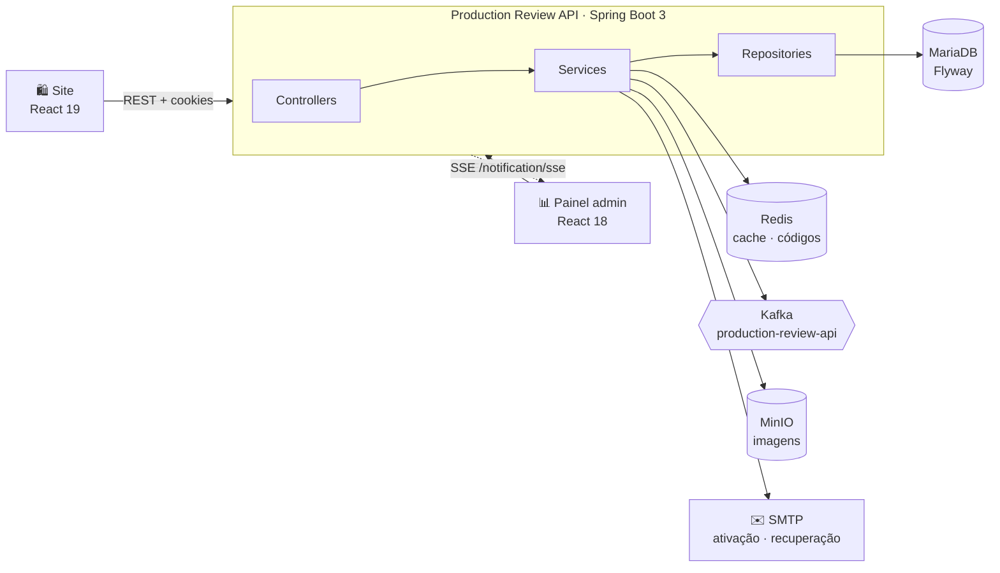
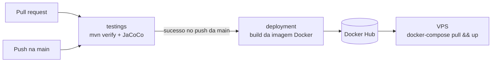

<div align="center">


# Production Review API

**API REST do ecossistema ReviewStore: autenticação, catálogo de produtos e avaliações.**
Alimenta o [site público](https://github.com/erikomis/dashboard-production-review-site) e o [painel administrativo](https://github.com/erikomis/dashboard-production-review-react).

<p>
  
  
  
  
</p>
<p>
  
  
  
  
  
  
</p>

[Visão geral](#-visão-geral) ·
[Como rodar](#-como-rodar) ·
[Endpoints](#-endpoints) ·
[Segurança](#-segurança) ·
[Testes](#-testes) ·
[Deploy](#-cicd-e-deploy)

</div>

<br />

<table>
  <tr>
    <td width="50%"></td>
    <td width="50%"></td>
  </tr>
  <tr>
    <td align="center"><sub><b>Site</b>: avaliações públicas</sub></td>
    <td align="center"><sub><b>Painel</b>: gestão do catálogo</sub></td>
  </tr>
</table>

---

## 🔭 Visão geral



| Recurso | Destaques |
|---|---|
| 🔐 **Autenticação** | Cadastro com ativação por e-mail, login por usuário ou e-mail, JWT em cookies `httpOnly` (access + refresh), recuperação de senha com código de 6 dígitos |
| 🗂 **Catálogo** | Categorias → subcategorias → produtos, com slug, busca parcial, ordenação e paginação |
| ⭐ **Avaliações** | Nota de 1 a 5, listagem por produto, resumo com média e total, e regra de autoria (só o autor ou um ADMIN altera) |
| 🖼 **Imagens** | Upload para MinIO com validação de tipo e chave única por produto |
| 🔔 **Tempo real** | Cada avaliação nova vai para um tópico Kafka e para um stream **SSE** consumido pelo painel |
| ⚡ **Cache** | Redis com evicção consistente nas escritas |
| 📖 **Documentação** | OpenAPI 3 + Swagger UI em `/swagger-ui.html` |
| 📈 **Observabilidade** | Actuator + Prometheus em `/actuator/prometheus`, com Grafana no `docker-compose` |

## 🚀 Como rodar

### Pré-requisitos

- **Java 17** (o projeto inclui o Maven Wrapper: `./mvnw`)
- **Docker** para MariaDB, Redis e, opcionalmente, Mailpit, Kafka e MinIO

### 1. Suba as dependências

```bash
docker run -d --name prv-mariadb -p 3306:3306 \
  -e MARIADB_ROOT_PASSWORD=root -e MARIADB_DATABASE=production mariadb:11.3

docker run -d --name prv-redis -p 6379:6379 redis:6.2

# opcional: caixa de e-mail local para ver os e-mails de ativação (http://localhost:8026)
docker run -d --name prv-mailpit -p 1026:1025 -p 8026:8025 axllent/mailpit
```

### 2. Rode a API

```bash
export DATABASE_URL=jdbc:mariadb://localhost:3306/production
export DATABASE_USERNAME=root DATABASE_PASSWORD=root
export REDIS=localhost
export SECRET=troque-por-um-segredo-longo
export ACESS_NAME=minio ACESS_SECRET=minio-secret
export MAIL_USERNAME=dev@local MAIL_PASSWORD=x
export ALLOWED_ORIGINS=http://localhost:5173,http://localhost:5174
export FRONTEND_URL=http://localhost:5173

./mvnw spring-boot:run -Dspring-boot.run.arguments="\
  --spring.mail.host=localhost --spring.mail.port=1026 \
  --spring.mail.properties.mail.smtp.auth=false \
  --spring.mail.properties.mail.smtp.starttls.enable=false"
```

A API sobe em **http://localhost:8084**, e o Flyway cria as tabelas e os perfis `ADMIN`, `USER` e `MODERATOR`.

> [!TIP]
> Para ter um administrador, cadastre-se normalmente (`POST /api/v1/auth/sign-up`), ative pelo link do e-mail e associe o perfil:
> ```sql
> INSERT INTO users_roles (user_id, role_id)
> SELECT u.id, r.id FROM user u, role r WHERE u.username = 'seu-usuario' AND r.name = 'ADMIN';
> ```

### Variáveis de ambiente

<details open>
<summary><b>Obrigatórias</b></summary>

| Variável | Descrição |
|---|---|
| `DATABASE_URL` · `DATABASE_USERNAME` · `DATABASE_PASSWORD` | Conexão com o MariaDB |
| `REDIS` | Host do Redis (porta 6379) |
| `SECRET` | Segredo HMAC dos tokens JWT, **sem valor padrão** de propósito |
| `ACESS_NAME` · `ACESS_SECRET` | Credenciais do MinIO |
| `MAIL_USERNAME` · `MAIL_PASSWORD` | Conta SMTP (Gmail por padrão) |

</details>

<details>
<summary><b>Opcionais</b></summary>

| Variável | Padrão | Descrição |
|---|---|---|
| `ALLOWED_ORIGINS` | `http://localhost:5173,http://localhost:8084,https://projetos-web.com` | Origens aceitas no CORS e nos links de e-mail |
| `FRONTEND_URL` | `https://projetos-web.com` | Base dos links de e-mail quando o `Origin` não está na lista |
| `URL` | `https://storage.projetos-web.com` | Endpoint do MinIO |
| `BUCKET_NAME` | `production-review` | Bucket das imagens |
| `KAFKA_BOOTSTRAP_SERVERS` | `localhost:9092` | Brokers do Kafka (sem Kafka, a API segue funcionando e só registra um aviso) |
| `PROFILE` | `dev` | Perfil ativo do Spring |

</details>

## 📡 Endpoints

Base: `/api/v1`. A documentação interativa completa fica em **`/swagger-ui.html`**.

<p align="center">
  
</p>

<details>
<summary><b>🔐 Autenticação</b> · <code>/auth</code> (pública)</summary>

| Método | Rota | Descrição |
|---|---|---|
| `POST` | `/auth/sign-up` | Cadastro (envia e-mail de ativação) |
| `GET` | `/auth/activate/{token}` | Ativa a conta (token válido por 24h) |
| `POST` | `/auth/sign-in` | Login por usuário ou e-mail; devolve cookies `token` e `refresh_token` |
| `POST` | `/auth/refresh-token` | Renova a sessão usando o refresh token |
| `POST` | `/auth/logout` | Encerra a sessão |
| `POST` | `/auth/send-recovery-code/send` | Envia código de recuperação de 6 dígitos |
| `GET` | `/auth/recovery-code?recoveryCode=&email=` | Valida o código |
| `PATCH` | `/auth/recovery-code/password` | Redefine a senha (código de uso único) |

</details>

<details>
<summary><b>🗂 Catálogo</b> · GET público, escrita só para ADMIN</summary>

| Método | Rota | Descrição |
|---|---|---|
| `GET` | `/category/list` | Categorias com subcategorias aninhadas |
| `GET` · `PUT` · `DELETE` | `/category/{id}` | Detalhe, edição e exclusão (409 se houver subcategorias) |
| `POST` | `/category/` | Cria categoria |
| `GET` | `/sub-categorie/list` | Subcategorias |
| `GET` · `PUT` · `DELETE` | `/sub-categorie/{id}` | Detalhe, edição e exclusão |
| `POST` | `/sub-categorie/create` | Cria subcategoria |
| `GET` | `/production/list?page&size&search&property&sort` | Produtos paginados, com busca parcial e ordenação |
| `GET` | `/production/{id}` · `/production/slug/{slug}` | Detalhe por id ou slug |
| `POST` | `/production/add` | Cria produto |
| `PUT` | `/production/update/{id}` | Edita produto |
| `DELETE` | `/production/delete/{id}` | Exclui produto |
| `POST` · `DELETE` | `/production/file` · `/production/file/{id}` | Upload e remoção de imagem (JPEG, PNG, WebP, GIF) |

</details>

<details>
<summary><b>⭐ Avaliações</b> · GET público, escrita exige login</summary>

| Método | Rota | Descrição |
|---|---|---|
| `GET` | `/review/list?page&size` | Todas as avaliações, mais recentes primeiro, com nome do produto e do autor |
| `GET` | `/review/product/{id}?page&size` | Avaliações de um produto |
| `GET` | `/review/product/{id}/summary` | `{ totalReviews, averageNote }` |
| `GET` | `/review/{id}` | Detalhe |
| `POST` | `/review/` | Publica avaliação (`note` de 1 a 5) |
| `PUT` · `DELETE` | `/review/{id}` | Só o autor ou um ADMIN |

</details>

<details>
<summary><b>👤 Usuário e notificações</b> · exige login</summary>

| Método | Rota | Descrição |
|---|---|---|
| `GET` | `/user/me` | Usuário logado com perfis e permissões |
| `GET` | `/notification/sse` | Stream SSE: um evento a cada avaliação criada |

</details>

### Formatos de resposta

```jsonc
// Página
{ "content": [ /* ... */ ], "page": { "size": 10, "number": 0, "totalElements": 42, "totalPages": 5 } }

// Erro
{ "message": "title: Title is required", "httpStatus": "BAD_REQUEST", "statusCode": 400 }
```

| Status | Quando |
|---|---|
| `400` | Validação, parâmetro inválido ou JSON malformado |
| `401` | Não autenticado, sessão expirada ou credenciais inválidas |
| `403` | Sem permissão, ou conta ainda não ativada no login |
| `404` | Recurso não encontrado |
| `409` | Registro duplicado ou em uso |

## 🛡 Segurança

- **JWT em cookies `httpOnly` + `Secure`**, com access e refresh token de tipos distintos: um não serve no lugar do outro.
- **Senhas** com BCrypt. **Códigos de recuperação** de 6 dígitos gerados com `SecureRandom`, com expiração no Redis, uso único e invalidação após 5 tentativas.
- **Links de e-mail** só usam o `Origin` da requisição se ele estiver em `ALLOWED_ORIGINS`, o que evita phishing com o domínio da aplicação.
- **Autorização** por perfil e permissão (`@PreAuthorize`), mais a regra de autoria nas avaliações.
- **Validação** de todos os payloads, com limites alinhados às colunas do banco, e erros sem expor SQL nem stack trace.
- **Nenhum segredo com valor padrão** no código: tudo vem do ambiente.

## 🧪 Testes

```bash
./mvnw verify   # testes + relatório de cobertura JaCoCo em target/site/jacoco
```

**156 testes** com cerca de **88% de cobertura de linhas**, distribuídos em:

| Camada | O que cobre |
|---|---|
| **Serviços** (Mockito) | Regras de negócio de auth, catálogo, avaliações e imagens |
| **Controllers** (`@WebMvcTest`) | Contratos HTTP, validação e códigos de erro |
| **Repositórios** (`@DataJpaTest` + H2) | Consultas de busca, resumo de notas, projeções e exclusões |
| **Segurança** (`@SpringBootTest`) | Rotas públicas e protegidas, perfis, CORS no preflight, refresh token |
| **Unitários** | JWT (tipos, expiração, assinatura) e paginação |

## 🔁 CI/CD e deploy



- **`testings.yml`**: roda em PRs e no push da `main`; publica os relatórios de cobertura e de testes.
- **`deployament.yml`**: só dispara depois que os testes do push na `main` passam, e builda exatamente o commit testado.
- **Imagem Docker**: build multi-stage com cache de dependências; o runtime usa JRE 17 com usuário sem privilégios.
- **`docker-compose.yml`**: API, Prometheus e Grafana. O `docker-compose.dev.yml` inclui também MariaDB e Redis.

<details>
<summary><b>📁 Estrutura do projeto</b></summary>

```text
src/main/java/com/client/productionreview/
├── config/          # cache, CORS, Swagger, MinIO, verificação de permissões
├── controller/      # endpoints REST + mappers DTO ↔ entidade
├── dtos/            # contratos de entrada e saída (com Bean Validation)
├── exception/       # exceções de domínio e handler global
├── integration/     # envio de e-mail
├── message/         # produtor Kafka
├── model/           # entidades JPA e hashes do Redis
├── provider/        # emissão e validação de JWT
├── repositories/    # Spring Data JPA e Redis
├── security/        # filtro de autenticação e SecurityFilterChain
├── service/         # regras de negócio
└── utils/           # paginação
src/main/resources/db/migration/   # migrações Flyway
```

</details>

## 🧩 Ecossistema Production Review

| Projeto | Descrição |
|---|---|
| [**production-review-api**](https://github.com/erikomis/production-review-api) | Este repositório: API REST |
| [**dashboard-production-review-site**](https://github.com/erikomis/dashboard-production-review-site) | Site público onde as pessoas avaliam produtos |
| [**dashboard-production-review-react**](https://github.com/erikomis/dashboard-production-review-react) | Painel administrativo do catálogo e das avaliações |

<div align="center">
<br />
<sub>Feito com ☕ e Spring Boot.</sub>
</div>
